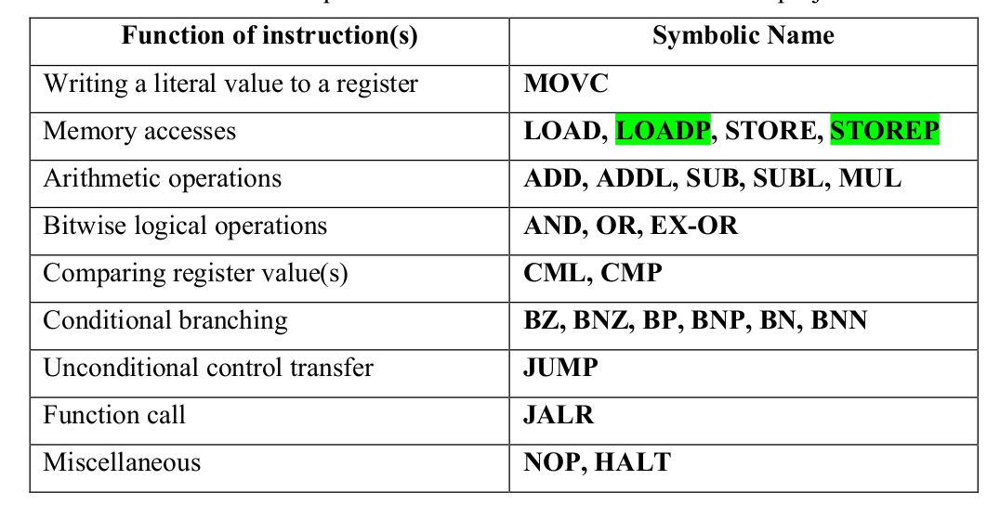
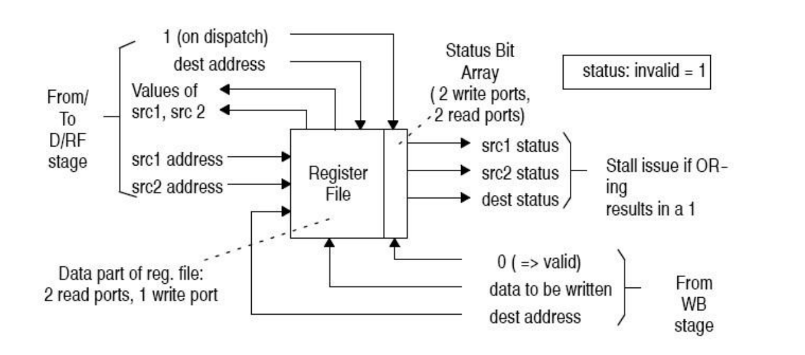
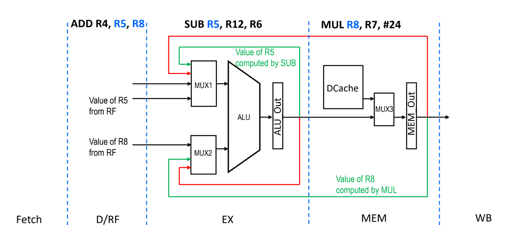

# APEX Pipeline Simulator 

`A Pipeline Example (APEX)`

A 5 Stage APEX In-order Pipeline


***This was done as a part of the CS520 Computer Architecture course**
## Notes:

 - This code is a simple implementation template of a working 5-Stage APEX In-order Pipeline
 - Implementation is in `C` language
 - Stages: Fetch -> Decode -> Execute -> Memory -> Writeback
 - All the stages have latency of one cycle
 - There is a single functional unit in Execute stage which performs all the arithmetic and logic operations
 - On fetching `HALT` instruction, fetch stage stop fetching new instructions
 - When `HALT` instruction is in commit stage, simulation stops

## Files:

 - `Makefile`
 - `file_parser.c` - Functions to parse input file
 - `apex_cpu.h` - Data structures declarations
 - `apex_cpu.c` - Implementation of APEX cpu
 - `apex_macros.h` - Macros used in the implementation
 - `main.c` - Main function which calls APEX CPU interface
 - `input.asm` - Sample input file

## How to compile and run

 Go to terminal, `cd` into project directory and type:
```
 make
```
 Run as follows:
```
 ./apex_sim <input_file_name>
```

## Author

 - Karthik Shanmugam

#### Warning - Future Students

`
Future students of this course have no right to copy/replicate this material. Doing so is at your own risk, as all submissions are compared with code on GitHub for plagiarism. It is not worth it.  
`
## Instruction Set



For a detailed description of the instructions, refer the [Requirements](/520F23Project1.pdf) document. 
# Stalling and Forwarding

##Part 1 : Stalling via Scoreboarding




Whenever there is a flow dependency (SRC <-->DEST) between any two instructions I1, I2, we need to stall the pipeline till the dependent instruction finishes execution and updates its respective architectural register. In order to do this, we implement a simple scoreboarding mechanism which tracks if a required architectural register is already been taken by an instruction or not. 


```
        case OPCODE_ADD:
        {
            if (cpu->regs_state[cpu->decode.rs1] == 0 && cpu->regs_state[cpu->decode.rs2] == 0) // dest regs have been updated
            {
                cpu->decode.rs1_value = cpu->regs[cpu->decode.rs1];
                cpu->decode.rs2_value = cpu->regs[cpu->decode.rs2];
                cpu->regs_state[cpu->decode.rd] = 1;
                cpu->execute = cpu->decode;
                cpu->decode.has_insn = FALSE;
                cpu->stall_pipeline = 0;
            }
            else
            {
                cpu->stall_pipeline = 1;
            }
            break;
        }

```

`regs_state` is a simple bit array[16] which holds the state of the architectural registers. If array[1] = 0 then R1 is free, else R1 is used by some instruction. 

## Part 2 : Forwarding


While we check for dependencies in the Decode/RF stage, it is possible that the dependent register which has been used by another instruction already holds the result either in the Execute (EX) or the Memory (MEM) stage. We can therefore forward the result into the decode stage so that the current instruction can pick up the value and proceed instead of stalling. This increases performance and avoids wastage of cycles due to stalling. 

While in real hardware, forwarding is achieved using forwarding busses, this simulater implementation retroactively goes into the EX and Mem stages from the D/RF stage and checks the result buffers.


```
        case OPCODE_ADD:
        {

            FORWARDED_DECODER_MUX_RS1(cpu);
            FORWARDED_DECODER_MUX_RS2(cpu); 
            if (cpu->regs_state[cpu->decode.rs1] == 0 && cpu->regs_state[cpu->decode.rs2] == 0) // dest regs have been updated
            {
                cpu->regs_state[cpu->decode.rd] = 1;
                cpu->execute = cpu->decode;
                cpu->decode.has_insn = FALSE;
                cpu->stall_pipeline = 0;
            }
            else
            {
                cpu->stall_pipeline = 1;
            }
            break;
        }
```
##### FORWARDED_DECODER_MUX_RS1 : 
 This function looks at the EX and MEM stages for the source register RS1 to check if the RS1 register already has the result available. And if so, it picks the result up and gives it to the current instruction : 

 ```
 void FORWARDED_DECODER_MUX_RS1(APEX_CPU *cpu)
{
        if(cpu->memory.has_insn)
        {   
            //don't get rd from EX if instruction is LOADP/LAOD -- LOADP only resolves rd in MEM stage
            if((cpu->memory.opcode!=OPCODE_LOADP && cpu->memory.opcode!=OPCODE_LOAD) && cpu->decode.rs1 == cpu->memory.rd)
            {
                cpu->decode.rs1_value = cpu->execute.result_buffer; 
                cpu->regs_state[cpu->decode.rs1] = 0; 
                return;
            }
            else if(cpu->memory.opcode==OPCODE_STOREP && cpu->decode.rs1 == cpu->memory.rs2)
            {
                cpu->decode.rs1_value = cpu->memory.rs2_value; 
                cpu->regs_state[cpu->decode.rs1] = 0; 
                return;
            }
            else if(cpu->memory.opcode==OPCODE_LOADP && cpu->decode.rs1 == cpu->memory.rs1)
            {
                cpu->decode.rs1_value = cpu->memory.rs1_value; 
                cpu->regs_state[cpu->decode.rs1] = 0; 
                return;
            }
        }
        if(cpu->writeback.has_insn)
         {
            if(cpu->decode.rs1 == cpu->writeback.rd)
            {
                cpu->decode.rs1_value = cpu->writeback.result_buffer; 
                cpu->regs_state[cpu->decode.rs1] = 0; 
                return;
            }
            else if(cpu->writeback.opcode==OPCODE_STOREP && cpu->decode.rs1 == cpu->writeback.rs2)
            {
                cpu->decode.rs1_value = cpu->writeback.rs2_value; 
                cpu->regs_state[cpu->decode.rs1] = 0; 
                return;
            }
            else if(cpu->writeback.opcode==OPCODE_LOADP && cpu->decode.rs1 == cpu->writeback.rs1)
            {
                cpu->decode.rs1_value = cpu->writeback.rs1_value; 
                cpu->regs_state[cpu->decode.rs1] = 0; 
                return; 
            }
         }

            cpu->decode.rs1_value = cpu->regs[cpu->decode.rs1];
}
 ```

 Since the pipeline is implemented backwards, the contents of the Ex stage is pushed to the MEM stage and the contents of the MEM stage is pushed to the WB stage, hence the MEM and WB stage are checked. 

 There is a similar function for RS2.


**For a detailed description of the project specs, refer the [Requirements](/520F23Project1.pdf) document.**